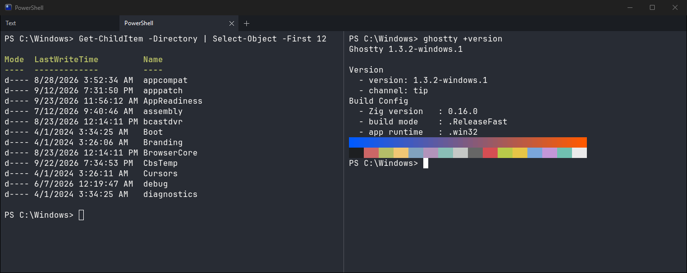
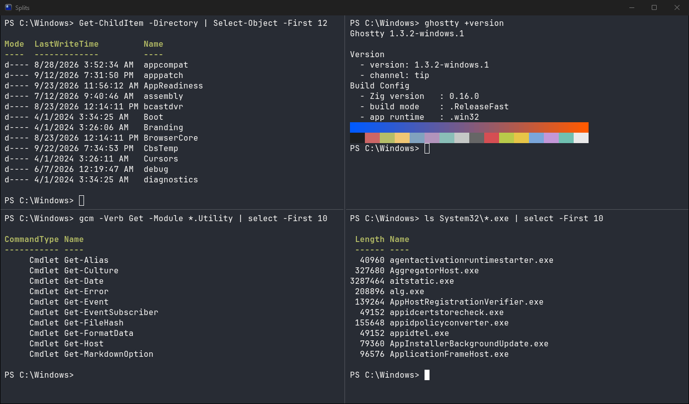
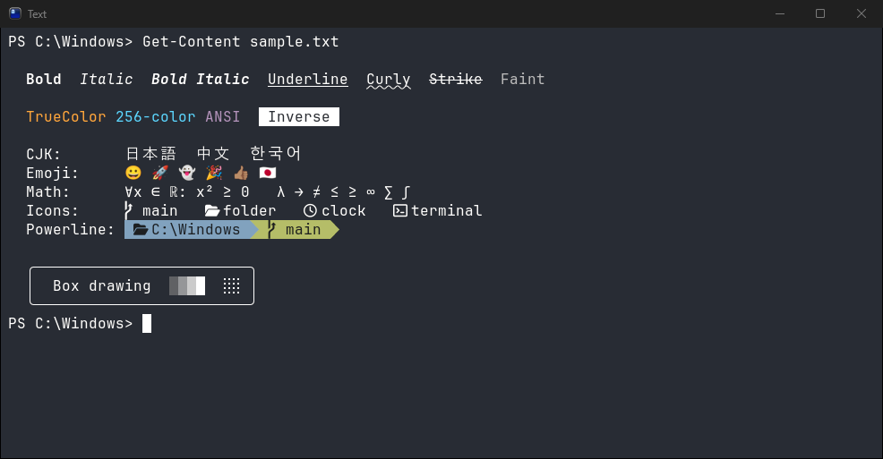
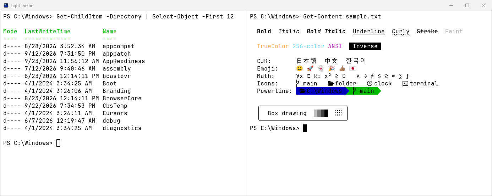

<!--
  Ghostty for Windows: an unofficial community port of the Ghostty terminal
  emulator to Windows 11 (native Win32, GPU-accelerated, OpenGL).
-->

<h1 align="center">Ghostty for Windows</h1>

<p align="center">
  <strong>The fast, feature-rich, GPU-accelerated Ghostty terminal emulator, running natively on Windows 11.</strong>
  <br />
  An unofficial community port of <a href="https://github.com/ghostty-org/ghostty">Ghostty</a> with a native Win32 UI, tabs, splits and first-class PowerShell support.
</p>

<p align="center">
  <a href="https://github.com/phalladar/ghostty-windows/releases/latest/download/Ghostty-Windows-Setup-x64.exe">
    
  </a>
  &nbsp;
  <a href="https://github.com/phalladar/ghostty-windows/releases/latest/download/Ghostty-Windows-x64.zip">
    
  </a>
</p>

<p align="center">
  <a href="https://github.com/phalladar/ghostty-windows/releases/latest"></a>
  <a href="https://github.com/phalladar/ghostty-windows/releases"></a>
  
  <a href="LICENSE"></a>
</p>

<p align="center">
  
</p>

> [!NOTE]
> **Ghostty for Windows is an unofficial, community-maintained port.** It is not affiliated with or endorsed by the [Ghostty project](https://ghostty.org) or its maintainers. For Ghostty on macOS and Linux, use the [official Ghostty](https://ghostty.org/download). Please report Windows issues [here](https://github.com/phalladar/ghostty-windows/issues), not upstream.

## Contents

- [Why Ghostty for Windows](#why-ghostty-for-windows)
- [Install](#install)
- [Screenshots](#screenshots)
- [Getting started](#getting-started)
- [FAQ](#faq)
- [Known issues](#known-issues)
- [Build from source](#build-from-source)
- [Contributing](#contributing)
- [Credits and license](#credits-and-license)

## Why Ghostty for Windows

[Ghostty](https://github.com/ghostty-org/ghostty) is a terminal emulator that is fast, feature-rich and native. This port brings it to Windows as a real Windows application instead of a wrapper:

- **Native Win32 app** written in Zig, with a Windows 11 title bar that follows the system light/dark theme, a taskbar icon and progress, and native dialogs.
- **GPU-accelerated rendering** with OpenGL: smooth scrolling and a high frame rate, synced to your display's refresh rate.
- **Tabs and splits**: drag tabs to reorder them, drag a tab out to open it in its own window, and split panes horizontally and vertically with draggable dividers.
- **Great text rendering**: bundled JetBrains Mono and Nerd Font symbols, Windows font discovery, CJK and emoji fallback, ligatures, and pixel-perfect box drawing and Powerline glyphs.
- **PowerShell-first shell integration**: PowerShell 7, Windows PowerShell 5.1 and `cmd.exe` work out of the box. You get prompt marks, exit codes, the working directory following you into new tabs and splits, and prompts (including oh-my-posh) that redraw cleanly when you resize.
- **Reflows on resize**: text rewraps correctly as you resize the window or a split.
- **Modern terminal features**: truecolor, the Kitty keyboard protocol, clickable OSC 8 hyperlinks, OSC 52 clipboard, bracketed paste, mouse reporting and high-DPI (per-monitor) scaling.
- **Works with your shell**: PowerShell, cmd, WSL (`wsl.exe`), Git Bash, or any other console program.
- **Same config as Ghostty everywhere**: your existing Ghostty config file and themes work on Windows.

## Install

### One-click installer (recommended)

1. Download **[Ghostty-Windows-Setup-x64.exe](https://github.com/phalladar/ghostty-windows/releases/latest/download/Ghostty-Windows-Setup-x64.exe)**.
2. Run it. It installs for your user only, so no administrator rights are needed, and adds a Start menu entry and an optional **"Open Ghostty here"** folder context menu.
3. Launch **Ghostty** from the Start menu.

> [!IMPORTANT]
> Releases are not code-signed yet, so Windows SmartScreen may show "Windows protected your PC". Click **More info → Run anyway**. You can check the download against `SHA256SUMS.txt` on the [release page](https://github.com/phalladar/ghostty-windows/releases/latest).

To uninstall, use **Settings → Apps → Installed apps → Ghostty**.

### Portable ZIP

Download **[Ghostty-Windows-x64.zip](https://github.com/phalladar/ghostty-windows/releases/latest/download/Ghostty-Windows-x64.zip)**, extract it anywhere, and run `ghostty\bin\ghostty.exe`. Nothing is written outside your user profile.

### Requirements

- Windows 11, x64. Windows 10 is not tested.
- A GPU driver with **OpenGL 4.3** (any current NVIDIA, AMD or Intel driver).

## Screenshots

<p align="center">
  
  <br /><em>Split panes in both directions, each running its own shell.</em>
</p>

<p align="center">
  
  <br /><em>Text rendering: styles, truecolor, CJK, emoji, Nerd Font icons, Powerline and box drawing.</em>
</p>

<p align="center">
  
  <br /><em>Light themes, with a matching Windows 11 title bar. Ghostty can follow the system light/dark setting.</em>
</p>

## Getting started

**Configuration.** Ghostty reads `%APPDATA%\ghostty\config.ghostty` and creates a commented template on first run. Press <kbd>Ctrl</kbd>+<kbd>,</kbd> to open it and <kbd>Ctrl</kbd>+<kbd>Shift</kbd>+<kbd>,</kbd> to reload. Every option is documented in the [Ghostty configuration reference](https://ghostty.org/docs/config). For example:

```ini
font-family = Cascadia Code
font-size = 12
theme = light:Builtin Light,dark:Builtin Dark
window-width = 120
window-height = 32
```

**Shell.** Ghostty starts PowerShell 7 (`pwsh.exe`) if it is installed, then Windows PowerShell, then `cmd.exe`. To pick another shell, set `command`:

```ini
command = wsl.exe ~
# command = cmd.exe
```

**Keyboard shortcuts** (the defaults match Ghostty on Linux):

| Keys                                                         | Action              |
| ------------------------------------------------------------ | ------------------- |
| <kbd>Ctrl</kbd>+<kbd>Shift</kbd>+<kbd>C</kbd> / <kbd>V</kbd> | Copy / paste        |
| <kbd>Ctrl</kbd>+<kbd>Shift</kbd>+<kbd>T</kbd>                | New tab             |
| <kbd>Ctrl</kbd>+<kbd>Shift</kbd>+<kbd>N</kbd>                | New window          |
| <kbd>Ctrl</kbd>+<kbd>Shift</kbd>+<kbd>O</kbd> / <kbd>E</kbd> | Split right / down  |
| <kbd>Ctrl</kbd>+<kbd>Alt</kbd>+<kbd>Arrow</kbd>              | Move between splits |
| <kbd>Alt</kbd>+<kbd>1</kbd>…<kbd>9</kbd>                     | Go to tab           |
| <kbd>Ctrl</kbd>+<kbd>Shift</kbd>+<kbd>W</kbd>                | Close tab           |
| <kbd>Ctrl</kbd>+<kbd>Enter</kbd>                             | Toggle fullscreen   |

Run `ghostty +list-keybinds --default` for the full list. From a terminal, `ghostty +new-tab` and `ghostty +new-window` open a tab or window in the running instance.

The complete Windows guide covers logs, crash reports, "Open Ghostty here" for the portable build, troubleshooting and packaging: **[README-windows.md](dist/windows/README-windows.md)**.

## FAQ

<details>
<summary><strong>Is there a Ghostty for Windows?</strong></summary>

The official Ghostty project currently ships for macOS and Linux. **Ghostty for Windows** (this repository) is a community port that builds Ghostty's core, the same terminal emulation, font and rendering engine, with a native Windows front end. You can [download it here](https://github.com/phalladar/ghostty-windows/releases/latest).
</details>

<details>
<summary><strong>Is this the official Ghostty?</strong></summary>

No. It is an unofficial port maintained by the community and is not affiliated with or endorsed by the Ghostty maintainers. It tracks upstream Ghostty and keeps Windows-specific changes separate so they could be offered upstream.
</details>

<details>
<summary><strong>Is Ghostty for Windows free?</strong></summary>

Yes. It is free and open source under the MIT License, like Ghostty itself.
</details>

<details>
<summary><strong>Does it work with WSL, Git Bash and other shells?</strong></summary>

Yes. Set `command` in your config, for example `command = wsl.exe ~`, or run the shell from a tab. Ghostty uses Windows' pseudo console (ConPTY), so any console program works.
</details>

<details>
<summary><strong>Does it work with PowerShell and oh-my-posh?</strong></summary>

Yes. Shell integration for PowerShell 7 and Windows PowerShell 5.1 is injected automatically, and multi-line oh-my-posh prompts redraw correctly when you resize a window or split.
</details>

<details>
<summary><strong>How is it different from Windows Terminal?</strong></summary>

Both are GPU-accelerated terminals that use ConPTY. Ghostty for Windows brings Ghostty's own terminal engine, configuration format, themes, keybindings and feature set to Windows. That matters most if you already use Ghostty on macOS or Linux and want the same terminal and config on every machine.
</details>

<details>
<summary><strong>Why does Windows SmartScreen warn about the installer?</strong></summary>

The installer is not code-signed yet. Choose **More info → Run anyway**, or verify the file against `SHA256SUMS.txt` from the release first.
</details>

<details>
<summary><strong>Does it run on Windows 10 or ARM64?</strong></summary>

Only Windows 11 on x64 is tested and released right now. It may work on recent Windows 10 builds with an OpenGL 4.3 driver. ARM64 builds are not produced yet.
</details>

## Known issues

- Not code-signed yet (see SmartScreen above) and not yet on winget.
- Not available yet: the quick terminal, global hotkeys, the terminal inspector, the command palette, search, and background transparency or blur.
- Color emoji use the bundled Noto Color Emoji rather than Segoe UI Emoji.
- OSC 52 clipboard _reads_ are not passed through by ConPTY; clipboard writes work.
- Notifications use tray balloons rather than Windows toast notifications.

The full list is in [README-windows.md](dist/windows/README-windows.md#known-issues).

## Build from source

You need [Zig](https://ziglang.org/download/) (the version in `build.zig.zon`) and the Visual Studio Build Tools with the C++ workload and a Windows 11 SDK.

```powershell
git clone https://github.com/phalladar/ghostty-windows.git
cd ghostty-windows
zig build -Dapp-runtime=win32 -Doptimize=ReleaseFast
.\zig-out\bin\ghostty.exe
```

For correct resizing, copy `conpty.dll` and `OpenConsole.exe` from Microsoft's [ConPTY NuGet package](https://www.nuget.org/packages/Microsoft.Windows.Console.ConPTY) next to `ghostty.exe`. The packaging script does this for you:

```powershell
pwsh -File dist\windows\make-zip.ps1 -Prefix zig-out
```

See [HACKING.md](HACKING.md) and [windows/docs](windows/docs/00-index.md) for development details.

## Contributing

Bug reports and pull requests for Windows-specific issues are welcome in this repository's [issue tracker](https://github.com/phalladar/ghostty-windows/issues). Please do not report Windows port issues to the upstream Ghostty project. For general Ghostty features and design, see the [upstream contributing guide](https://github.com/ghostty-org/ghostty/blob/main/CONTRIBUTING.md).

## Credits and license

Ghostty for Windows is built on **[Ghostty](https://github.com/ghostty-org/ghostty)** by Mitchell Hashimoto and the Ghostty contributors. All of the terminal emulation, rendering and font engine comes from their work; this repository adds the Windows application layer and packaging.

Ghostty is licensed under the MIT License, Copyright (c) 2024 Mitchell Hashimoto, Ghostty contributors. This port is distributed under the same license; see [LICENSE](LICENSE). Release builds also bundle Microsoft's MIT-licensed ConPTY (`conpty.dll`, `OpenConsole.exe`) and fonts under the SIL Open Font License, MIT and BSD licenses. See [THIRD-PARTY-NOTICES.md](dist/windows/THIRD-PARTY-NOTICES.md).

"Ghostty" is the name of the upstream project. This port uses the name only to describe what it is: a Windows port of Ghostty.
